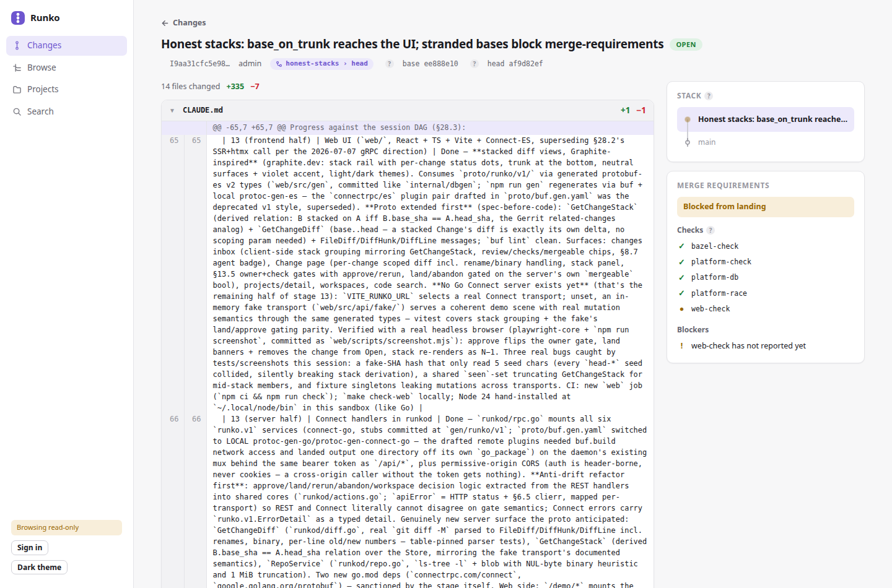

# Runko

Runko is a self-hosted monorepo platform on plain Git: first-class projects
inside one repository, change-based review (Gerrit-style `refs/for/` pushes),
path ownership, affected-based CI scoping, and rebase-based landing with
merge gates enforced server-side. Humans and coding agents use the same
CLI/API surface; agents get stricter, server-enforced policy. Apache-2.0.

Runko develops on Runko. The source of record is a public instance —
**browse the code, changes, and review history without an account**:

- **Code**: <https://runko.victornazzaro.com/runko>
- **Changes**: <https://runko.victornazzaro.com/runko/changes>
- **Playground**: <https://runko.victornazzaro.com/demo/> — the UI on sample data, entirely in your browser
- **Clone**: `git clone https://runko.victornazzaro.com/o/runko/repo.git` (or this mirror)

This GitHub repository is the read-only mirror of that instance, updated
automatically on every landing (including `refs/changes/*`, so any change's
exact commit is fetchable here too).



Git is the only storage substrate — Postgres holds a rebuildable index of
trunk, never a second source of truth. Each project directory carries a
`README.md` that is its spec surface — what it owns, its decided
constraints, and a dated Decisions section; the original design spec,
[`docs/design.md`](docs/design.md), is frozen as the historical record
(see [`docs/README.md`](docs/README.md) for the documentation model).

## How changes land here

There are no direct pushes to `main` and no merged PRs, anywhere. A change
is pushed to `refs/for/main`, passes receive policy and a secret scan,
gets its required checks from the `PROJECT.yaml` manifests it affects —
each project declares its own check *commands*, and CI is a generic
executor that runs whatever `runko-ci checks` resolves for the change —
and lands by rebase once the gates are green. The repo is carved into
projects with declared `dependencies:` edges; some projects declare no
checks at all and are gated through the reverse-dependency closure. The self-hosting migration
and everything it surfaced is recorded in
[`docs/migration-findings.md`](docs/migration-findings.md).

## Status

Working end-to-end and in daily use by its own development (which is the
current test of record). The per-stage engineering history is
[`docs/implementation-log.md`](docs/implementation-log.md). Implemented: the
`runkod` daemon (smart-HTTP git, receive funnel, REST + Connect APIs,
merge gates, automerge, multi-org, outbound mirror), the `runko`/`runko-ci`
CLIs, workspaces (snapshot refs + sparse cones; single-use for agents),
ephemeral per-task agent identities with server-enforced policy, affected
computation with a Bazel build-graph adapter and per-check classes
(`run_when: direct | affected`), immutable releases with changelogs derived
from landed changes and tag governance at receive, code search (Zoekt), an
MCP server, the web UI (stacked review with syntax-highlighted folding
diffs, a code browser with history and blame, search), public read-only
orgs, a CI watchdog, and a measured docker-compose eval loop. Expect rough
edges; hardening findings land as ordinary changes.

## Repository layout

Every project folder has a `README.md` — start there.

```
docs/               the frozen design spec + histories, contract schemas (docs/spec/),
                    the CLI output contract (docs/cli-contract.md)
db/                 Postgres DDL (db/migrations) and sqlc queries (db/queries)
internal/           shared internals (gitstore, gitfixture test harness, sqlc output)
platform/           control-plane libraries: receive, land, affected, checks,
                    index, project templates, search, mirror, build adapters, MCP
runkod/             the daemon: pre-receive processor, smart-HTTP, REST + Connect APIs;
                    runkod/proto/ is its Connect contract (web <-> runkod), gen committed
runkod/cmd/         runkod and runko-bridge (webhook -> GitHub Actions shim) entrypoints
watchdog/           runko-watchdog, the CI reconciler: force-reports finished-but-unreported
                    runs, one rescue rerun for lost dispatches
mailer/             runko-mailer, the invite-request notifier (SMTP over the operator feed)
web/                web UI (React + TypeScript + Vite + Connect-ES)
cli/runko/          human/agent-facing CLI
cli/runko-ci/       CI-facing CLI
```

## Running your own

```bash
git clone https://github.com/saxocellphone/Runko.git && cd Runko
docker compose up
```

That brings up the control plane (runkod + Postgres) at
`http://localhost:8080` with two eval users, `alice` and `bob` — clone
through it, push a change to `refs/for/main` as one, approve as the other,
land it. `scripts/compose-smoke.sh` drives that loop end to end; CI times
it on every landing. The web UI runs separately for now:
`cd web && VITE_RUNKO_URL=http://localhost:8080 npm install && npm run dev`.

## The CLI

Everything the platform does is a command — the web UI is a view, not the
interface. The daily loop:

```bash
runko project create --name payments-api --type service --lang go
runko workspace create --name fix-sku --project payments-api --by you  # your slice, from one shared clone
runko change push                        # -> review; checks scoped to what changed
runko change requirements --json         # owners + checks outstanding, machine-readable
runko change land                        # rebase-lands once the gates are green
runko change automerge --change I…       # or: arm once, it lands itself when they go green
```

Design rules, documented in [`docs/cli-contract.md`](docs/cli-contract.md):
every command takes `--json`; exit codes are 0/1/2 (success / failure /
usage); every refusal is a structured `{code, message, suggestion}` where
the suggestion is a command you can type. Coding agents use the same
binary, taught by a generated `AGENTS.md` (`runko agents-md`); CI uses
`runko-ci` (`affected` computes impact offline from the tree, `checkout`
does partial-clone sparse checkouts, `report-check` posts results with
retries).

## Running coding agents

Agents are ordinary API clients with stricter, server-enforced defaults —
none of it is prompt engineering:

```bash
runko agent create --task fix-sku        # mints agent-fix-sku-3f2a: its own token, dead by TTL
runko workspace create --name fix-sku …  # one task = one workspace, enforced
runko change push                        # per-change size caps nudge stacks, not monoliths
runko change automerge --change I…       # the agent never polls; the server lands when green
```

Each agent identity is minted per task and named for the work, so
`authored_by`, workspace ownership, and the review badge all answer "what
was this agent doing" by construction. Agent workspaces are single-use and
auto-close when their last change concludes; oversized changes are refused
at receive with the split workflow in the message (a stack of small
changes passes where the same volume as one change is refused); agents can
never approve their own changes, mint other agents, or hold operator
powers. This repo is built almost entirely by agents working under exactly
these rules.

### Installing

Prebuilt `runko` and `runko-ci` binaries (Linux/macOS/Windows) are on the
[releases page](https://github.com/saxocellphone/Runko/releases/tag/cli-latest),
rebuilt automatically whenever a landing affects the CLI. From source:

```bash
go install github.com/saxocellphone/runko/cli/runko@latest
go install github.com/saxocellphone/runko/cli/runko-ci@latest
```

## Building and testing

```bash
git clone https://runko.victornazzaro.com/o/runko/repo.git runko
cd runko
make check     # fmt + vet + test, all packages
```

Requires Go 1.25+ and `git` on `PATH`. The test suite needs no other
services — it uses throwaway local Git repositories.

Optional suites, each with its own toolchain: `make check-race`,
`make check-db` (live Postgres), `make check-web` (Node ≥ 22),
`make check-bazel` (build graph + gazelle drift) and
`make check-bazel-test` (the same test suite under Bazel — what CI's
per-project checks run, scoped), `make check-compose` (Docker; the timed
end-to-end eval loop).

## Contributing

Pull requests cannot be merged on GitHub — this repo is a mirror, and a
divergent `main` would freeze it. Issues and discussion are welcome here;
code changes go through review on the Runko instance.

## Decisions (repo-wide)

Decisions scoped to a single project are recorded in that project's
`README.md`; entries here are the ones that cross project boundaries.
The record through 2026-07-16 is [`docs/design.md`](docs/design.md)'s
frozen changelog.

- **2026-07-16** — the centralized spec is retired: `docs/design.md` is
  frozen as the historical record and each project's `README.md`
  becomes its living spec surface, with dated Decisions sections
  replacing the central changelog
  ([`docs/README.md`](docs/README.md) documents the model).

## License

Apache-2.0. See [`LICENSE`](LICENSE).
