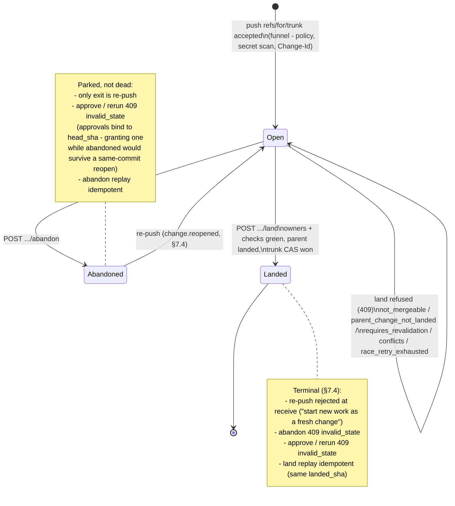

# Change lifecycle — the state machine

The Change state machine as **implemented** (§7.4's three states, §13.5's
gates, §8.7's approval rules). `runkod/statemachine_test.go` is the
executable form of this document: every cell of the transition matrix below
is driven through the real cores against a real bare repo, so this diagram
and the code cannot silently drift. If you change a transition, change the
table here, the diagram, and the test table together.

States live in one place (`change_state` in Postgres / `Change.State`):
**open**, **abandoned**, **landed**. Everything else people call "state" —
mergeable, requires-revalidation, checks green — is *derived at read time*
from the tree, the check runs, and the approvals (tree-as-truth, §10.3),
deliberately not stored, and therefore not a state here.

## Transition matrix

The authoritative table — `TestChangeStateMachine` executes it cell by cell.
"—" means the event cannot address that state (a Change that doesn't exist
yet only answers 404 / fresh-create).

One push can carry a whole stack (series receive, §7.4, decided 2026-07-08
with the jj-first client direction): the **push** row below then applies to
*each* Change-bearing commit in the series independently — open members
amend, abandoned members reopen, landed members are skipped as history
context (only a landed **tip** rejects the push).

| event \ state       | *(none)*        | open | abandoned | landed |
|---------------------|-----------------|------|-----------|--------|
| **push** (accepted funnel, same Change-Id) | create → **open**; base = merge-base(head, trunk) or nearest pending ancestor Change's commit (stacked, §7.4) | amend → **open**: head/base/title/authored_by move with the push; approvals reset by head binding (§13.5); origin workspace/branch preserved when the push carries none | reopen → **open** (`change.reopened`) | **rejected at receive**: "landed is terminal", start a fresh Change |
| **approve**         | 404 | recorded, bound to current head; refused for the head's own pusher (`self_approval_denied`, §8.7), agents (`agent_approval_denied`, §13.5), non-required owners (`not_a_required_owner`) | 409 `invalid_state` | 409 `invalid_state` |
| **rerun check**     | 404 | allowed for required checks | 409 `invalid_state` | 409 `invalid_state` |
| **abandon**         | 404 | → **abandoned** | idempotent (stays abandoned) | 409 `invalid_state` |
| **land**            | 404 | see land outcomes below | 409 `invalid_state` | idempotent success (same `landed_sha`) |

### Land outcomes from *open* (§13.5)

Evaluated in this order; every refusal leaves the Change **open**:

1. `parent_change_not_landed` (409) — recorded base is a commit trunk doesn't
   have: the Change is stacked on a pending parent; ancestors land first
   (landing base..head alone would drop the parent's content).
2. `not_mergeable` (409) — the same per-principal `Mergeable` bool
   `GET .../merge-requirements` reports: outstanding owners, failing/pending
   required checks, stale checks, default-deny with no policy at all.
3. `requires_revalidation` (409) — trunk moved since the checked head and the
   trunk delta intersects the Change's affected set; recovery is rebase +
   re-push (an amend, which re-binds base/head) + re-green + land.
4. `conflicts` (409) — the rebase itself conflicts.
5. `race_retry_exhausted` (409) — lost the trunk compare-and-swap 5 times.
6. **landed** — trunk advanced, `landed_by` attributed, `change.landed`
   webhook, Zoekt reindex triggered.

### Guards that are not transitions

These refuse the *event*, not the state — the Change stays where it was:

- Receive funnel (any push): §6.9 trunk closure, secret scan, agent policy
  (affinity/caps/denylist), workspace-origin validation, snapshot caps.
- Bot lanes (§14.10.2): out-of-allowlist land is 403 `bot_lane_path_denied`
  ("may never", evaluated before gates); a lane land waives the human-owner
  gate but adds the lane's own required checks.
- Approve attribution: named principals approve as themselves
  (`approved_by_mismatch` otherwise).
